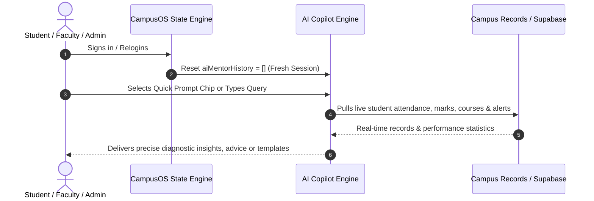

# 🎓 CampusOS — Next-Generation Enterprise University Operating System


**CampusOS** is a state-of-the-art, all-in-one unified University ERP, Campus Safety, Real-Time Fleet Operations, and Academic Intelligence Operating System. Engineered with a responsive zero-dependency architecture, CampusOS connects **Students**, **Faculty**, and **Administrators** into a synchronized real-time ecosystem powered by **Supabase Cloud Database & Realtime Channels**.

---

## 📑 Table of Contents
- [✨ Key Architecture & Technology Highlights](#-key-architecture--technology-highlights)
- [🏛️ Role-Based Portals & Feature Matrix](#️-role-based-portals--feature-matrix)
  - [1. 🎒 Student Portal](#1--student-portal)
  - [2. 👩‍🏫 Faculty Portal](#2--faculty-portal)
  - [3. 🛡️ Administrator Command Center](#3-️-administrator-command-center)
- [🤖 CampusOS AI Intelligence & Academic Copilot](#-campusos-ai-intelligence--academic-copilot)
- [🚨 Campus Safety, Priority SOS & Emergency Dossier Center](#-campus-safety-priority-sos--emergency-dossier-center)
- [☁️ Supabase Cloud Integration & Live Sync](#️-supabase-cloud-integration--live-sync)
- [🚀 Quick Start & 1-Click Demo Accounts](#-quick-start--1-click-demo-accounts)
- [📂 Project Structure](#-project-structure)

---

## ✨ Key Architecture & Technology Highlights

- **Single-File Zero-Dependency Architecture**: Entire application, UI styling, SVG icon system, client state management, and real-time networking packaged into [`index.html`](./index.html).
- **Multi-Role Authentication**: Seamless switching between **Student**, **Faculty**, and **Administrator** profiles with tailored navigation, permissions, and dashboards.
- **Supabase Realtime Cloud Sync**: Real-time Postgres database integration with instant cross-tab and cross-device synchronization.
- **Offline-First Resilience**: Automatic fallback to local persistent storage during network disruptions, auto-syncing changes upon reconnection.
- **Modern UI & Theming**: Enterprise-grade UI design with glassmorphism, responsive typography, intuitive grid layouts, and full **Dark / Light Mode** switching.
- **Clean Academic Nomenclature**: Pure course code and title cataloging (e.g. `CSE2001: Data Structures & Algorithms`), cleanly eliminating complicated slot artifacts while preserving Theory (35 min) and Lab Practical (1 hour) session dynamics.

---

## 🏛️ Role-Based Portals & Feature Matrix

```mermaid
graph TD
    A[CampusOS Platform] --> B[Student Portal]
    A --> C[Faculty Portal]
    A --> D[Administrator Command Center]
    
    B --> B1[Academic Dashboard & CGPA]
    B --> B2[Attendance & Future Simulator]
    B --> B3[Placement Cell Drives]
    B --> B4[Mental Wellbeing & Box Breathing]
    B --> B5[Parent / Guardian Link]
    B --> B6[Emergency SOS & Visitor Passes]
    B --> B7[Fees, Sports Subs & Verified Invoices]
    B --> B8[AI Campus Mentor]

    C --> C1[Faculty Overview & Cabin Presence]
    C --> C2[Attendance Marking: Theory / Lab]
    C --> C3[Semester Marks Upload 30/70]
    C --> C4[Parent Advisory Communications]
    C --> C5[Faculty AI Academic Copilot]
    
    D --> D1[Operations Control & Directives]
    D --> D2[Live SOS Alert Stream & Dossiers]
    D --> D3[Visitor Pass Approvals]
    D --> D4[Curriculum Hub & Exams Host]
    D --> D5[Debarment Relief & Medical ODs]
    D --> D6[Complaints Directorate & Deletion]
    D --> D7[Fee Collections & Campus Fleet]
```



---

### 1. 🎒 Student Portal

| Module | Features & Capabilities |
| :--- | :--- |
| **Academic Dashboard** | Real-time GPA/CGPA gauge, upcoming exams countdown banner, registered curriculum list, today's schedule preview, and university announcements. |
| **Attendance & Future Simulator** | Theory (35 min) vs Lab Practical (1 hr) granular percentages, last 10 session sparklines, **Interactive Future Prediction Engine** (*Attending / Not Attending / Ignored*), and 75% minimum debarment risk alerts. |
| **Debar Exemption & Medical OD** | Submit on-duty (OD) attendance credit petitions with medical certificates, hospital discharge summaries, or official event documentation. |
| **Marks & CGPA Ledger** | Comprehensive academic transcript ledger showing Continuous Assessment (Internal: 30M), Semester Exams (External: 70M), aggregate grades, and credits. |
| **Weekly Class Timetable** | Clean weekly schedule matrix displaying subject codes, course titles, class timings, and assigned lecture halls/labs. |
| **Examination Schedule** | Mid-Sem (*Soft Skill Exam 1*) and End-Sem (*Soft Skill Exam 2*) schedules, room numbers, maximum marks, and syllabus overviews. |
| **Campus Placement Cell** | Tier-1 Super Dream, Dream & Core recruitment drives (**Google ₹58.2 LPA**, **Microsoft ₹51 LPA**, **Apple ₹54 LPA**, **Meta ₹52 LPA**, **NVIDIA ₹48.5 LPA**, **Amazon ₹44 LPA**, **Adobe ₹42 LPA**). Features 1-click application submission, registered badges, and application withdrawal. |
| **Mental Wellbeing & Mindfulness** | Daily emotional mood tracker, interactive animated 4-4-4-4 box breathing guide, Pomodoro timer recommendations, and counseling resources. |
| **Parent / Guardian Link** | Full transparency into official advisories, academic alerts, and attendance caution notices dispatched to parents by faculty, with 1-click student acknowledgment. |
| **Emergency SOS & Safety** | 2-second press-and-hold tactile buzzer, custom campus GPS location selector, instant campus patrol guard dispatch, and 7-day confidential incident reporting with auto-purge countdown. |
| **Visitor Pass Management** | Submit official campus visitor pass requests for visiting parents or guests, with real-time gate approval tracking. |
| **Payment Invoices Vault & Fees** | Online semester tuition fee payments, optional sports/fitness subscriptions (*Gym, Olympic Swimming Pool, Tennis, Badminton, Squash, Rock Climbing*), and permanent printable verified receipts. |
| **Live Shuttle & Bus Radar** | Real-time simulated campus shuttle radar with live route movement, waypoint stops, and ETA countdowns. |
| **2D Campus Map & Directions** | Interactive campus building explorer (*Technology Tower, Silver Jubilee Tower, Main Building, Academic Rotunda*) with custom start-to-end route navigation. |
| **AI Campus Mentor** | Emotionally intelligent conversational assistant with quick-tap question chips, study tips, exam advice, cabin availability lookups, and automated session resets on relogin. |

---

### 2. 👩‍🏫 Faculty Portal

| Module | Features & Capabilities |
| :--- | :--- |
| **Faculty Overview & Cabin Control** | Real-time **"In Cabin" / "Not in Cabin"** presence toggle visible instantly across student portals; displays official physical workstation coordinates (*Building, Room, Floor, Wing, Proximity Landmark, Extension*). |
| **Mark Class Attendance** | Granular Theory Lecture (35m) vs Laboratory Practical (1h) attendance marking with instant percentage recalculation across student, parent, and admin views. |
| **Upload Semester Marks** | Direct entry ledger for Continuous Internal Assessment (30 Marks) and Final Semester Written/Practical Examinations (70 Marks). |
| **Class Schedule & Roster** | Comprehensive student roster with registration IDs, academic CGPAs, attendance percentages, and direct contact numbers. |
| **Parent & Guardian Communications** | Transmit custom performance notices, attendance shortage warnings, and consultation invites directly to student guardians, with automatic synchronization to the student portal. |
| **Faculty AI Academic Copilot** | Dedicated diagnostic AI engine providing 12 quick-tap prompts for student attendance shortage detection (<75%), top academic performer analysis, at-risk student remediation plans, and draft parent advisory generation. |

---

### 3. 🛡️ Administrator Command Center

| Module | Features & Capabilities |
| :--- | :--- |
| **Operations Control Center** | High-priority active emergency SOS alert banner, live security statistics, pending grievance monitor, and broadcast administrative directives publisher. |
| **Emergency SOS & Contact Dossier Center** | Real-time incident triage with comprehensive dossiers: <br>• **Faculty Dossiers**: Employee ID, Department, Subject, Cabin Chamber, Floor/Wing, Landmark, Direct Extension, and "Call Faculty" button.<br>• **Student Dossiers**: Registration ID, Department, Semester, **Women's Residential Hostel (G-Block)** / Men's Hostel (B-Block) residence, Room numbers, Father & Mother contacts, permanent address, and "Call Student / Parent" buttons. |
| **Visitor Pass Approvals** | 1-click review, gate assignment, and authorization/rejection of guest pass requests. |
| **Course Curriculum Hub** | Register, modify, and manage curriculum modules with Subject Code, Course Title, Credits, Department, Semester, and Assigned Instructor. |
| **Host & Schedule Examinations** | Schedule Mid-Sem and Final semester examination papers, configure exam halls, and broadcast timetables to student and faculty schedules. |
| **Debarment Relief & Medical ODs** | Review student medical discharge proofs and grant 1-click official On-Duty (OD) attendance credits. |
| **Complaints & Grievances Directorate** | Multi-category grievance management with status tracking, resolver logging, and **Full Admin Deletion & Archiving Permissions** for resolved complaints. |
| **Faculty & Cabin Directorate** | Directory oversight, instructor course mapping, physical cabin assignments, and office hour configurations. |
| **Institutional Fee Collections** | Comprehensive revenue audit for tuition fees and facility/sports subscriptions. |

---

## 🤖 CampusOS AI Intelligence & Academic Copilot

CampusOS features a contextual, emotionally intelligent AI engine tailored dynamically to the logged-in user's role:



### ⚡ Role-Tailored Prompt Chips & Diagnostic Capabilities
- **For Administrator (`Admin AI Operations Copilot`)**:
  - *"Are there any active emergency SOS alerts on campus right now?"* → Reports live active emergency alerts with student/faculty details, locations, and direct phone contacts.
  - *"How many student complaints and grievances are pending?"* → Summarizes open grievance cases with category, submitter info, description, and status.
  - *"Are there any visitor passes pending for administrative approval?"* → Checks authorization queues with visitor names, purpose, host details, and requested gates.
  - *"Show me an overview and academic health of all students"* → Comprehensive overview of total enrollment, average CGPA, top achievers, debarment shortages, and individual student profile lookups.
  - *"Which students have attendance debarment shortages (<75%)?"* → Identifies students in danger of exam debarment with their hostel rooms and guardian phone numbers.
  - *"List all female students and their hostel block rooms"* → Displays female students, their **Women's Residential Hostel (G-Block)** room numbers, CGPA, and parents' contacts.
  - *"How many faculty members are currently in their cabins?"* → Real-time tally of faculty currently in their physical cabins vs out of cabin with workstation locations and extensions.
  - *"What are the latest confidential campus incident reports?"* → Live review of monitored campus safety incidents with 7-day retention countdowns.
  - *"Are there pending debarment exemption or medical OD petitions?"* → Queue of pending student medical OD claims with attached proofs.
  - *"Summarize institutional fee collection & facility revenues"* → Financial audit of tuition collection rates and facility subscription revenues.
- **For Faculty (`Faculty AI Academic Copilot`)**:
  - *"Which students have attendance below 75% in my course?"* → Flags at-risk students (e.g. *Rohan Gupta at 68%*) with debarment warnings.
  - *"Which students are performing best in academics?"* → Highlights top academic performers (e.g. *Diya Patel 94/100, Ishita Verma 91/100, Aarav Sharma 88/100*).
  - *"Which students are struggling or bad in academics / need advisory?"* → Diagnoses weak areas (low internal scores, irregular attendance, exam difficulties) and suggests 1-on-1 cabin counseling.
  - *"Draft an academic warning advisory for struggling students"* → Generates a ready-to-dispatch official parent notice.
  - *"List all female students in my course for hostel mentoring"* → Displays female students, their **Women's Residential Hostel (G-Block)** rooms, and academic standing.
- **For Students (`University AI Mentor`)**:
  - Theory & Lab attendance breakdown, exam schedules, study strategies, faculty cabin availability, placement drive advice, and stress-reduction techniques.
- **Session Auto-Reset & Confirmation**:
  - The AI chat history automatically resets upon every login or logout, ensuring private, fresh, role-specific sessions.
  - Interactive **Logout Confirmation Modal** prevents accidental session terminations across all user portals.

---

## 🚨 Campus Safety, Priority SOS & Emergency Dossier Center

CampusOS provides a mission-critical campus safety infrastructure designed for rapid emergency response:

1. **Tactile 2-Second Emergency Buzzer**:
   - Requires an intentional 2-second press-and-hold with animated SVG progress feedback to prevent accidental triggers.
2. **GPS & Landmark Incident Tracking**:
   - Dispatches emergency signals with exact location tags (e.g. *Technology Tower VLSI Labs, 2nd Floor*).
3. **Role-Specific Emergency Dossiers**:
   - **Faculty Alerts**: Displays Faculty Title & Name (*Dr. Ananya Rao*), Employee ID (*EMP101*), Department (*CSE*), Physical Cabin Chamber (*Room TT-210*), Building (*Technology Tower*), Proximity Landmark, and Direct Extension.
   - **Female Student Alerts**: Badged with **`Female Student`**, highlighting **`Women's Residential Hostel (G-Block)`**, Room Number (*Room G-208*), Student Phone, and Parent/Guardian phone numbers with direct call shortcuts.
   - **Male Student Alerts**: Displays **`Men's Residential Hostel (B-Block)`**, Room Number, Student Mobile, and Father/Mother emergency contacts.
4. **Patrol Guard Dispatch & Resolution**:
   - 1-click campus security patrol team dispatch and administrative resolution logging.

---

## ☁️ Supabase Cloud Integration & Live Sync

CampusOS is engineered to work out-of-the-box in standalone mode or connected to a **Supabase Postgres Database** for live multi-device synchronization:

### 🚀 3-Minute Supabase Cloud Setup

1. **Create a Free Supabase Project**:
   - Visit [supabase.com](https://supabase.com) and create a free project named `CampusOS`.
2. **Execute Database Schema**:
   - In your Supabase dashboard, navigate to the **SQL Editor**.
   - Copy the contents of [`supabase_schema.sql`](./supabase_schema.sql), paste into the editor, and click **Run**.
3. **Connect CampusOS**:
   - In Supabase, go to **Project Settings > API** and copy your **Project URL** and **anon / public key**.
   - Open CampusOS in your browser, click the **☁️ Supabase** button in the top navigation bar, paste your credentials, and click **Save & Connect**.
   - The badge will immediately switch to **🟢 Supabase Connected (Live Cloud Sync)**.

---

## 🚀 Quick Start & 1-Click Demo Accounts

### Running the Application
No build steps, package installations, or complex dependencies required:
```bash
# Simply open index.html in any modern web browser
start index.html        # Windows
open index.html         # macOS
xdg-open index.html     # Linux
```

### 🔑 Demo Accounts (Pre-Seeded for Testing)

| Role | Name | University ID | Password | Key Highlights |
| :--- | :--- | :--- | :--- | :--- |
| **Student (Male)** | Aarav Sharma | `25bce1001` | `Student123` | High Performer (CGPA 8.9), Men's Hostel B-304 |
| **Student (Female)** | Diya Patel | `25bce1002` | `Student123` | Top Achiever (CGPA 9.6, 96% Att), Women's Hostel G-208 |
| **Student (Female)** | Ishita Verma | `25bce1004` | `Student123` | High Performer (CGPA 9.3), Women's Hostel G-315 |
| **Student (Male - At Risk)**| Rohan Gupta | `25bce1005` | `Student123` | At-Risk Student (68% Att, Debar Risk), Men's Hostel B-412 |
| **Faculty (Teacher)** | Dr. Ananya Rao | `EMP101` | `Fac101A` | Prof. of CSE, Cabin TT-210 (Technology Tower) |
| **Faculty (Teacher)** | Prof. Vikram Singh| `EMP102` | `Fac102B` | Prof. of ECE, Cabin SJT-402 (Silver Jubilee Tower) |
| **Administrator** | Dr. R. K. Sundaram | `admin` | `AdminPass123` | Dean of Academic & Institutional Operations |

---

## 📂 Project Structure

```
campusos/
├── index.html              # Core single-file application (UI, CSS, JS, State, Realtime Engine)
├── README.md               # Comprehensive documentation and integration guide
└── supabase_schema.sql     # Production Supabase PostgreSQL schema with RLS & Realtime
```

---

## 📄 License
This project is licensed under the **MIT License**. Free for educational, institutional, and research deployments.
